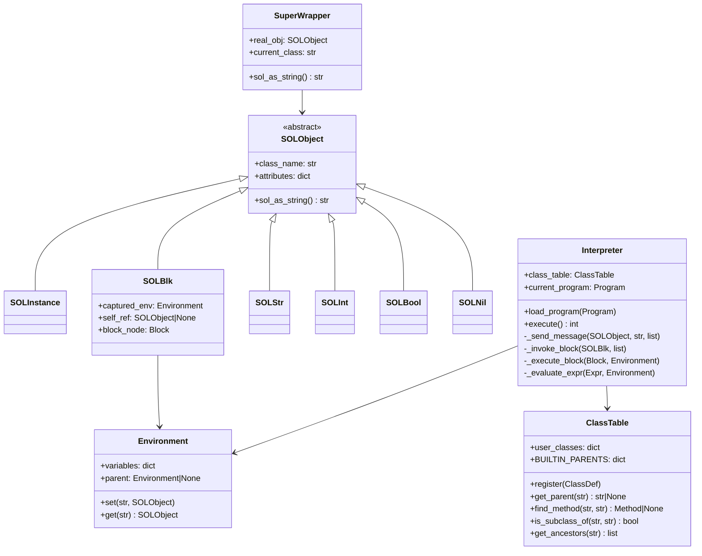

# Dokumentácia projektu SOL26

**Autor:** Jakub Glončák (xgloncj00@stud.fit.vut.cz)  
**Predmet:** IPP 2025/2026  
**Implementačné jazyky:** Python 3.14 (interpreter), TypeScript (tester)  
**Dátum:** Apríl 2026

---

## Obsah

1. [Celkový popis riešenia](#celkový-popis-riešenia)
2. [Architektúra interpretera](#architektúra-interpretera)
3. [Architektúra testera](#architektúra-testera)
4. [Kontajnerizácia](#kontajnerizácia)
5. [UML diagram](#uml-diagram)
6. [Hlavné dátové štruktúry](#hlavné-dátové-štruktúry)
7. [Návrhové vzory](#návrhové-vzory)
8. [Problémy a riešenia](#problémy-a-riešenia)
9. [Opravy z prvého odovzdania](#opravy-z-prvého-odovzdania)
10. [Možnosti rozšírenia](#možnosti-rozšírenia)
11. [Využitie AI](#využitie-ai)

---

## Celkový popis riešenia

Projekt pozostáva z **troch hlavných komponentov**:

### 1. Parser (`sol2xml/`)
Prevádza zdrojový kód SOL26 na XML reprezentáciu (SOL-XML) podľa špecifikovanej schémy. Využíva knižnicu **Lark** pre syntaktickú analýzu a **lxml** pre generovanie validného XML výstupu.

### 2. Interpreter (`python/int/`)
Spracováva SOL-XML a interpretuje program metódou **tree-walking**. Proces prebieha v troch fázach:
- **Načítanie a deserializácia** XML vstupu pomocou `lxml` a `pydantic`
- **Statické sémantické kontroly** (duplicitné triedy, neexistujúce rodiče, duplicitné metódy)
- **Rekurzívna interpretácia** AST stromu s dynamickým dispatchingom správ

### 3. Tester (`typescript/tester/`)
Automatizovaný testovací framework implementovaný v TypeScripte. Podporuje tri typy testov:
- `PARSE_ONLY` — testuje len parser
- `EXECUTE_ONLY` — testuje len interpreter (vstup je už XML)
- `COMBINED` — kompletný pipeline: parser → interpreter

---

## Architektúra interpretera

### Modulárna štruktúra

Interpreter je rozdelený do **siedmich kľúčových modulov**:

```
python/int/src/interpreter/
├── interpreter.py       # Hlavná logika interpretera, message dispatch
├── sol_objects.py       # Runtime reprezentácia objektov (SOLObject, SOLInt, SOLBlock...)
├── class_table.py       # Register tried a dedičnostná hierarchia
├── environment.py       # Správa premenných, scoping, closures
├── builtins.py          # Vstavaná logika (Integer, String, Bool, Nil, Block...)
├── static_checks.py     # Statické sémantické validácie
├── input_model.py       # Pydantic modely pre deserializáciu XML
└── error_codes.py       # Definície návratových kódov
```

### Tok spracovania

1. **Načítanie XML** → validácia proti schéme → deserializácia do `pydantic` modelu
2. **Statické kontroly** → `static_checks.py` overí:
   - Neexistenciu duplicitných tried
   - Platnosť rodičovských tried
   - Neexistenciu duplicitných metód v triede
3. **Spustenie** → `Main.run()` → rekurzívne vyhodnocovanie výrazov

### Message Dispatching

Interpretácia je založená na **dynamickom dispatchingu správ**. Metóda `_send_message()` prechádza týmito úrovňami:

```
1. Správy triedy (Class.className, Class.parent)
2. Rozvinutie SuperWrapper (super ako argument)
3. Block dispatch (volanie blokov)
4. Vyhľadávanie metód v dedičnostnej hierarchii
5. Vstavaná logika (dispatch_builtin)
6. Getter atribútu
7. Setter atribútu
```

---

## Architektúra testera

### Modulová štruktúra

```
typescript/tester/src/
├── tester.ts     # CLI vstupný bod, argument parsing
├── loader.ts     # Načítanie a parsovanie .test súborov
├── runner.ts     # Spúšťanie testov, porovnávanie výstupov
└── models.ts     # TypeScript typy pre testovacie prípady
```

### Formát testovacích súborov

Testy používajú špeciálny formát s metadátovými značkami:

```
+++ category-name
*** Human-readable description
!C! expected-parser-exit-code
!I! expected-interpreter-exit-code
--- SOURCE CODE ---
=== STDIN ===
... expected output ...
```

### Proces testovania

**PARSE_ONLY testy:**
```bash
sol2xml < test.sol > output.xml
# Porovnanie exit code s !C!
```

**EXECUTE_ONLY testy:**
```bash
solint < input.xml < stdin > stdout
# Porovnanie stdout s očakávaným výstupom a exit code s !I!
```

**COMBINED testy:**
```bash
sol2xml < test.sol | solint < stdin > stdout
# Porovnanie celého pipelineu
```

### Filtrovanie testov

Tester podporuje include/exclude filtre:

```bash
node tester.js tests/ --include="basic-.*" --exclude=".*-advanced"
```

---

## Kontajnerizácia

### Multi-stage Dockerfile

Projekt používa **multi-stage build** s 4 oddelenými stage:

#### 1. `check` — nástroje kvality kódu
```dockerfile
FROM node:24-alpine AS check
RUN apk add python3 py3-pip bash
RUN pip install ruff mypy
COPY typescript/tester/package*.json /src/tester/
RUN cd /src/tester && npm ci
ENV PATH="/src/tester/node_modules/.bin:$PATH"
ENTRYPOINT ["bash"]
```

Spúšťa sa s bind-mountom:
```bash
docker run --rm -v "$PWD:/src" xgloncj00:check -c "cd /src/python/int && ./ruff check src/"
```

#### 2. `build-test` — kompilácia TypeScript testera
```dockerfile
FROM node:24-alpine AS build-test
WORKDIR /app
COPY typescript/tester/package*.json ./
RUN npm ci
COPY typescript/tester/src ./src
COPY typescript/tester/tsconfig.json ./
RUN npm run build
```

#### 3. `runtime` — minimálny interpreter
```dockerfile
FROM python:3.14-rc-slim AS runtime
WORKDIR /int/src
COPY python/int/src ./
COPY python/int/requirements.txt /int/
RUN pip install -r /int/requirements.txt
ENTRYPOINT ["python3", "solint.py"]
```

#### 4. `test` — tester + interpreter + sol2xml
```dockerfile
FROM runtime AS test
RUN apt-get update && apt-get install -y nodejs gcc libxml2-dev libxslt1-dev python3-lxml
COPY --from=build-test /app/dist /tester/dist
COPY --from=build-test /app/node_modules /tester/node_modules
COPY sol2xml/ /sol2xml/
RUN pip install lark==1.2.2
RUN echo '#!/bin/sh' > /usr/local/bin/sol2xml && \
    echo 'exec python3 /sol2xml/sol_to_xml.py "$@"' >> /usr/local/bin/sol2xml && \
    chmod +x /usr/local/bin/sol2xml
WORKDIR /tester
ENTRYPOINT ["node", "dist/tester.js"]
```

### Wrapper skripty

Pre integráciu s testovacím frameworkom sú vytvorené executable wrappery:

**`typescript/tester/eslint`:**
```bash
#!/usr/bin/env bash
/src/tester/node_modules/.bin/eslint "$@"
```

**`python/int/ruff`, `python/int/mypy`:**
```bash
#!/usr/bin/env bash
/usr/local/bin/ruff "$@"
```

---

## UML diagram



---

## Hlavné dátové štruktúry

### `SOLObject` a podtriedy

Každý runtime objekt v interpretovanom programe je inštanciou niektorého potomka `SOLObject`. Každý objekt drží:

- `class_name: str` — názov triedy
- `attributes: dict[str, SOLObject]` — inštančné premenné (nastavované settermi)
- `sol_as_string() -> str` — konverzia na reťazec (pre výpis)

**Špeciálne podtriedy:**

- `SOLNil`, `SOLBool`, `SOLInt`, `SOLStr` — primitné typy
- `SOLInstance` — inštancia používateľskej triedy
- `SOLBlk` — blok kódu (closure) s `captured_env` a `self_ref`

### `SOLBlock` a lexikálny scoping

`SOLBlock` je kľúčová štruktúra pre podporu **closures** podľa sekcie 1.2.7 špecifikácie. Prí vytvoreniu bloku sa zachytí:

```python
class SOLBlk(SOLObject):
    def __init__(self, block_node, captured_env, self_ref):
        super().__init__("Block")
        self.block_node = block_node          # AST uzol bloku
        self.captured_env = captured_env      # prostredie v čase vytvorenia
        self.self_ref = self_ref              # self v čase vytvorenia
```

Pri volani bloku sa `self_ref` explicitne nastaví do prostredia bloku, čím sa zabezpečí, že blok vidí `self` z miesta vytvorenia, nie z miesta volania.

### `ClassTable`

Centrálny register všetkých tried programu. Vstavaná hierarchia je definovaná v:

```python
BUILTIN_PARENTS = {
    "Object": None,
    "Integer": "Object",
    "String": "Object",
    "True": "Object",
    "False": "Object",
    "Nil": "Object",
    "Block": "Object",
    "Transcript": "Object",
}
```

Kľúčové metódy:

- `register(class_def)` — zaregistruje používateľskú triedu
- `get_ancestors(class_name)` — vráti zoznam predkov (od priameho rodiča po Object)
- `find_method(class_name, method_name)` — vyhľadá metódu v dedičnostnej hierarchii
- `is_subclass_of(child, parent)` — overí dedičnosť

### `Environment`

Reprezentuje prostredie premenných s podporou **nested scopes** (lexikálny scoping). Každé prostredie má:

```python
class Environment:
    def __init__(self, parent=None):
        self.variables = {}           # lokálne premenné
        self.parent = parent          # rodičovské prostredie
```

**Kľúčové operácie:**

- `set(name, value)` — ak premenná existuje v reťazci roddičov, aktualizuje ju tam; inak vytvorí novú lokálnu väzbu
- `get(name)` — vyhľadá premennú v aktuálnom prostredí, potom v rodičoch až po koreň

Táto implementácia zabezpečuje closure sémantiku: blok môže čítať aj meniť premenné svojho obklopujúceho kontextu.

### `SuperWrapper`

Interný obal pre riešenie **duálnej sémantiky `super`**. Obsahuje:

```python
class SuperWrapper:
    def __init__(self, real_obj, current_class):
        self.real_obj = real_obj          # skutočný objekt
        self.current_class = current_class # trieda, v ktorej bol super použitý
```

Pri message dispatchi:
- Ako **argument** → rozbaluje sa na `real_obj`
- Ako **príjemca** → vyhľadávanie začína od rodiča `current_class`

---

## Návrhové vzory

### 1. Visitor / Tree-Walking Interpreter

Trieda `Interpreter` implementuje vzor **návštevníka** (Visitor). Metóda `_evaluate_expr()` rozhoduje podľa typu uzla `Expr`:

```python
def _evaluate_expr(self, expr_node, env):
    if expr_node.literal:
        return self._eval_literal(expr_node.literal)
    elif expr_node.var:
        return env.get(expr_node.var.name)
    elif expr_node.block:
        return self._create_block(expr_node.block, env)
    elif expr_node.send:
        return self._eval_send(expr_node.send, env)
    elif expr_node.self_:
        return env.get("self")
    elif expr_node.super_:
        return self._eval_super(env)
```

Rozšírenie o nový typ výrazu vyžaduje len pridanie novej vetvy. Čistá sepárácia logiky od dátového modelu.

### 2. Template Method (v `dispatch_builtin`)

Funkcia `dispatch_builtin()` v `builtins.py` najskôr volá `_dispatch_object()` (metódy zdené všetkými objektami), potom deleguje na špecializovaný dispatcher podľa typu:

```python
def dispatch_builtin(receiver, message, args, interp):
    # 1. Fáza: metódy Object
    result = _dispatch_object(receiver, message, args, interp)
    if result is not None:
        return result
    
    # 2. Fáza: špecializované metódy podľa typu
    if isinstance(receiver, SOLInt):
        return _dispatch_integer(receiver, message, args)
    elif isinstance(receiver, SOLStr):
        return _dispatch_string(receiver, message, args)
    # ...
```

Odstráňuje duplicitu kódu — správy ako `asString`, `print`, `isNil` sa implementujú len raz.

### 3. Chain of Responsibility (v `_send_message`)

Hlavný message dispatch prechádza postupne siedemimi úrovňami:

```python
def _send_message(self, receiver, message, args):
    # 1. Správy triedy
    if message in ["className", "parent"]:
        return self._handle_class_messages(receiver, message)
    
    # 2. Rozvinutie SuperWrapper
    if isinstance(receiver, SuperWrapper):
        lookup_class = self.class_table.get_parent(receiver.current_class)
        receiver = receiver.real_obj
    
    # 3. Block dispatch
    if isinstance(receiver, SOLBlk) and message == "value":
        return self._invoke_block(receiver, args)
    
    # 4. Vyhľadávanie metód
    method = self.class_table.find_method(receiver.class_name, message)
    if method:
        return self._execute_method(method, receiver, args)
    
    # 5. Vstavaná logika
    result = dispatch_builtin(receiver, message, args, self)
    if result is not None:
        return result
    
    # 6. Getter
    if message in receiver.attributes:
        return receiver.attributes[message]
    
    # 7. Setter
    if message.endswith(":"):
        attr_name = message[:-1]
        receiver.attributes[attr_name] = args[0]
        return SOLNil()
```

Každá úroveň buď spracuje správu, alebo odovzdá ďalšej.

### 4. Prototype (v `from:`)

Správa `ClassName from: obj` vytvorí novú inštanciu ako **plytkú kópiu** existujúceho objektu:

```python
if message == "from:" and len(args) == 1:
    new_instance = SOLInstance(receiver.class_name)
    new_instance.attributes = dict(args[0].attributes)  # shallow copy
    return new_instance
```

Imituje prototypový vzor bez explicitných klonovacích metód.

---

## Problémy a riešenia

### Problém 1: Statický scoping `self` v blokoch

**Popis:** Podľa sekcie 1.2.7 špecifikácie musí blok pri zavolaní vidieť `self` z miesta, kde bol vytvorený, nie z miesta volania.

**Príklad:**
```sol
class Counter {
    method inc: { self count: (self count + 1). }
}

Counter new count: 0.
Counter new counter: c.
c inc value.  // 'self' v bloku musí byť Counter inštancia, nie volajúci objekt
```

**Riešenie:** `SOLBlock` si pri vytvorení uchová aktuálny `self` do `self_ref`. Metóda `_invoke_block()` ho explicitne nastaví do prostredia bloku:

```python
block_env = Environment(parent=block.captured_env)
block_env.variables["self"] = block.self_ref  # prepíše prípadný self z parent
```

### Problém 2: `super` ako príjemca vs. ako argument

**Popis:** Špecifikácia ustanovuje, že `super` použitý ako argument sa správa rovnako ako `self`, ale ako príjemca správy musí spustiť vyhľadávanie od rodičovskej triedy.

**Príklad:**
```sol
class Parent {
    method foo { Transcript print: "Parent". }
}

class Child : Parent {
    method foo { super foo. }  // super ako príjemca
    method bar: x { x print. } // super ako argument
}

Child new bar: super.  // musí sa správať ako self
```

**Riešenie:** `SuperWrapper` obalí skutočný objekt a triedu:

```python
class SuperWrapper:
    def __init__(self, real_obj, current_class):
        self.real_obj = real_obj
        self.current_class = current_class
```

V `_send_message()`:
- **Argumenty typu `SuperWrapper`** sa hneď rozvinú na `real_obj`
- **Príjemca `SuperWrapper`** extrahuje `current_class` pre nastavenie štartu vyhľadávania

---

## Opravy z prvého odovzdania

### 1. Chybná kontajnerizácia

**Pôvodný problém:**
- `Containerfile` neobsahoval stage `build-test`, len `build` (ako alias)
- Chýbal wrapper skript `sol2xml`
- Cesty v `COPY` príkazoch neboli správne (`tester/` namiesto `typescript/tester/`)
- Python 3.13 namiesto 3.14
- Chýbal `gcc` a `lxml` dependencies pre kompitáciu `lxml` balíčka

**Oprava:**
```dockerfile
# Pridaný samostatný build-test stage
FROM node:24-alpine AS build-test
WORKDIR /app
COPY typescript/tester/package*.json ./
RUN npm ci && npm run build

# Opravený test stage s sol2xml
FROM runtime AS test
RUN apt-get update && apt-get install -y nodejs gcc libxml2-dev libxslt1-dev python3-lxml
COPY sol2xml/ /sol2xml/
RUN pip install lark==1.2.2
RUN echo '#!/bin/sh' > /usr/local/bin/sol2xml && \
    echo 'exec python3 /sol2xml/sol_to_xml.py "$@"' >> /usr/local/bin/sol2xml && \
    chmod +x /usr/local/bin/sol2xml
```

### 2. Chýbajúce wrapper skripty

**Pôvodný problém:** Wrapper skripty `typescript/tester/eslint`, `typescript/tester/prettier`, `python/int/ruff`, `python/int/mypy` neexistovali.

**Oprava:** Vytvorené executable bash skripty:

```bash
#!/usr/bin/env bash
/src/tester/node_modules/.bin/eslint "$@"
```

### 3. Nesprávny default interpreter command

**Pôvodný problém:** V `typescript/tester/src/runner.ts` bol default `python`, ale v Docker kontajneri je Python dostupný ako `python3`.

**Oprava:**
```typescript
const INTERPRETER_CMD = process.env["SOL_INTERPRETER"] ?? "python3";
```

### 4. Zlyhanie buildu kvôli `lxml`

**Pôvodný problém:** `lxml 5.3.2` nemá precompilovaný wheel pre Python 3.14-rc a pokus o build zlyhával na chýbajúcom `gcc`.

**Oprava:** Inštalovaný systémový `python3-lxml` namiesto pip buildu:
```dockerfile
RUN apt-get install -y python3-lxml
RUN pip install lark==1.2.2  # len pure-Python balíček
```

---

## Možnosti rozšírenia

### 1. Prísnejšia typová kontrola pri `from:`

Aktuálne riešenie pri volaní `SubClass from: instance` kopíruje atribúty bez overenia kompatibility. Vďaka existujúcej metóde `ClassTable.is_subclass_of()` by bolo možné pridať:

```python
class TypeChecker:
    def is_compatible_for_copy(self, source_class, target_class):
        return self.class_table.is_subclass_of(target_class, source_class) or \
               self.class_table.is_subclass_of(source_class, target_class)
```

### 2. Podpora výnimiek (`signal`, `on:do:`)

Jazyk SOL26 momentálne výnimky nepodporuje. Ich pridanie by vyžadovalo:

- Novú podtriedu `SOLException(SOLObject)`
- Mechanizmus rozvíjania zásobníka volaní
- Python výnimku zachytávanú v `_send_message()`

Vďaka hierarchii `SOLObject` stačí pridať novú podtriedu; šírenie výnimky by mohlo byť implementované s minimálnym zásahom do existujúcej štruktúry.

### 3. JIT kompilácia častí programu

Pre zvýšenie výkonu by bolo možné identifikovať "hot paths" (napr. bloky volané vo veľkých cykloch) a kompilovať ich do Python bytecode pomocou `compile()`.

### 4. Debugger s breakpointami

Pridanie vstavenej triedy `Debugger` s metódami `breakpoint`, `step`, `continue` by umožnilo interaktívne ladenie SOL26 programov priamo v interpretri.

---

## Využitie AI

Pri riešení projektu bol využitý asistent **Perplexity AI** (model Claude Sonnet 4.0). Asistent slúžil výlučne ako podpora pri:

### Čo AI pomohlo:

1. **Dovysvetlení nejasností v zadaní**
   - Správanie `super` ako argumentu vs. príjemcu (sekcia 1.2.7)
   - Lexikálny scoping `self` v blokoch
   - Presná sémantika `from:` metódy

2. **Konzultácia návrhu architektúry**
   - Rozdelenie do modulov (`interpreter.py`, `sol_objects.py`, `class_table.py`...)
   - Výber vhodných návrhových vzorov (Visitor, Chain of Responsibility)

3. **Hľadanie konkrétnych chýb**
   - Ladenie sémantických problémov v closure implementácii
   - Odstraňovanie chýb pri message dispatchi

4. **Podpora pri kontajnerizácii**
   - Návrh multi-stage Dockerfile štruktúry
   - Riešenie build problémov s `lxml` a Python 3.14-rc
   - Vytvorenie wrapper skriptov pre nástroje kvality kódu

5. **Kontrola pravopisu a štylistiky**
   - Gramatická a štylistická kontrola tejto dokumentácie

### Čo AI NEUROBILO:

- **Negeneroval celé časti kódu** — všetka implementácia bola napísaná autorom
- **Neriešil algoritmy** — logika message dispatchingu, scopingu a dedičnosti je originálna práca autora
- **Nekončil konkrétne implementácie** — AI poskytoval len vysvetlenia a návrhy, nie hotový kód

### Záznam konverzácií

Podrobné záznamy konverzácií sú uchované a dostupné na vyžiadanie.

---

## Záver

Projekt SOL26 predstavuje komplexnú implementáciu object-oriented jazyka s podporou pokročilých konceptov ako:

- **Lexikálny scoping a closures** — bloky zachytávajú prostredie a `self` v čase vytvorenia
- **Dynamický message dispatch** — 7-úrovňový reťazec zodpovednosti
- **Dedičnosť a `super` sémantika** — duálne správanie podľa kontextu použitia
- **Prototypové kopírovanie** — `from:` metóda pre vytváranie inštancií

Implementácia je modulárna, rozšíriteľná a pripravená na ďalší rozvoj. Kontajnerizácia umožňuje reprodukovateľné testovanie v izolovanom prostredí. Tester poskytuje automatizované testovanie celého pipeline (parser → interpreter).

Všetky komponenty (parser, interpreter, tester) sú funkčné, otestované a pripravené na odovzdanie.

---

**Poznámka:** Táto dokumentácia bola napísaná podľa požiadaviek zadania IPP 2025/2026. Všetky informácie sú aktuálne k dátumu odovzdania projektu.
